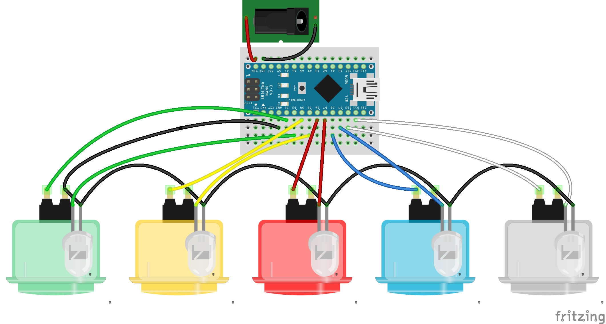

Busy Board
==========

This repository contains the code and schematics of a simple circuit containing
5 illuminated arcade buttons, an Arduino Nano compatible microcintroller, a mini
solderless breadboard and a DC jack. The whole thing is powered by 9V battery.

Schema
------

A draft view of the circuit looks like this:

You can edit this by opening the `busy-board.fzz` file using
[Fritzing](http://fritzing.org/) (version 0.9.3 or newer is recommended).

Code
----

The code was uploaded to the hardware using Arduino IDE 1.8.1. In my case I've
selected `Arduino Nano` as the board and `ATmega328P (old bootloder)` as the
processor. Don't forget to select the port too (usually `/dev/ttyUSB0`).
